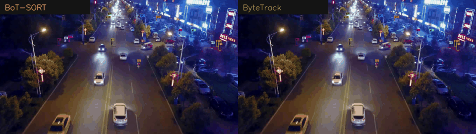

# UAV Human Tracking with YOLO

This project detects and tracks people in aerial UAV footage. It combines a YOLO11 detector with ByteTrack or BoT-SORT, supports VisDrone and AFO data preparation, and produces annotated videos, benchmark reports, and deployable model exports.

## Tracking Demo



The preview compares BoT-SORT (left) and ByteTrack (right) on the VisDrone `uav_high_119` sequence.


## Features

- Human-only detection with a YOLO11s model at 1280px inference resolution.
- Dataset conversion for VisDrone and AFO annotations into YOLO format.
- ByteTrack and BoT-SORT tracking with UAV-specific configurations.
- Compact active-track IDs for readable video annotations.
- Tracking, latency, and model export utilities.
- MP4 outputs and Markdown benchmark reports.

## Data Mapping

VisDrone categories `1` and `2`, plus AFO annotations with `classTitle: human`, are mapped to YOLO class `0: human`. Invalid boxes and annotations with `score = 0` are ignored. Coordinates are normalized and exported to `data/dataset/images` and `data/dataset/labels`.

## Setup

```bash
pip install -r requirements.txt
```

The default trained weights are expected at `runs/detect/v1_yolo11s_1280/weights/best.pt`. The dataset config template is `src/data_pipeline/dataset.yaml`; running the pipeline generates `data/dataset/dataset.yaml`.

## Usage

Build the YOLO dataset:

```bash
python -m src.data_pipeline.run_pipeline
```

Train the detector:

```bash
python -m src.train
```

Run tracking on a video:

```bash
python src/track.py --source data/samples/uav_high_119.mp4 --tracker botsort --save
```

Run the ByteTrack vs BoT-SORT benchmark:

```bash
python src/benchmark_trackers.py --source all --device 0
```

Outputs are written to `output/tracking/` and the comparison report is written to `output/benchmark/tracker_comparison.md`.

## Tracker Comparison

Benchmark settings: YOLO11s, 1280px input, confidence `0.15`, IoU `0.5`, NVIDIA RTX 4050.

| Video | ByteTrack FPS | BoT-SORT FPS | ByteTrack mean people/frame | BoT-SORT mean people/frame |
| :--- | ---: | ---: | ---: | ---: |
| `uav_crowd_088` | **19.49** | 10.92 | 77.8 | **88.0** |
| `uav_high_119` | **18.26** | 11.62 | 19.0 | **22.9** |
| `uav_street_009` | **14.86** | 11.11 | 19.1 | **26.4** |

### Choosing a Tracker

- **ByteTrack:** faster and better suited to real-time or embedded deployment.
- **BoT-SORT:** slower but usually retains more detections in crowded or moving-camera scenes through appearance features and camera-motion compensation.

The benchmark's total track IDs are raw tracker instances over a video, not a ground-truth count of unique people. Short detector gaps or occlusions can create new raw track instances.
